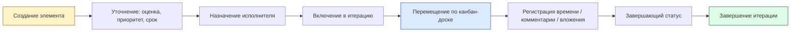

# 040 — Event Storming

> Формат — см. [`../documents-composition.md`](../documents-composition.md#040--event-storming-040event-stormingmd).
> Источник — [`../vision.md`](../vision.md). Основа для [050 — Entities](050.entities.md).

| Триггер / команда | Агрегат | Доменное событие | Кто подписан / реакция |
|---|---|---|---|
| Создать рабочий элемент | РабочийЭлемент | WorkItemCreated | История изменений; Уведомления, если сразу задан исполнитель |
| Изменить поля карточки | РабочийЭлемент | WorkItemFieldsChanged | История изменений, Уведомления (исполнителю) |
| Назначить / переназначить исполнителя | РабочийЭлемент | AssigneeChanged | История изменений, Уведомления (новому исполнителю) |
| Переместить на канбан-доске | РабочийЭлемент | StatusChanged | История изменений, Уведомления, Итерация (пересчёт показателей) |
| Создать/перенести дочерний элемент | РабочийЭлемент | HierarchyChanged | Бэклог, Иерархия, История изменений, Уведомления |
| Оценить трудоёмкость | РабочийЭлемент | WorkItemFieldsChanged (plannedHours) | Родительский элемент (пересчёт суммы), История изменений, Уведомления |
| Зарегистрировать время | ЗаписьТрудозатрат | TimeLogged | РабочийЭлемент (пересчёт факта и остатка), История изменений, Уведомления |
| Добавить/изменить/удалить комментарий | Комментарий | CommentChanged | История изменений, Уведомления |
| Прикрепить / удалить файл | Вложение | AttachmentChanged | История изменений, Уведомления |
| Создать итерацию | Итерация | Внутренний шаг: отдельного события нет | — |
| Задать ёмкость участника | Итерация | Внутренний шаг: отдельного события нет | Планирование (расчёт резерва/перегрузки) |
| Включить / исключить задачу из итерации | Итерация | IterationCompositionChanged | РабочийЭлемент, История изменений, Уведомления |
| Запустить итерацию | Итерация | IterationActivated | Снимок базового плана |
| Завершить итерацию | Итерация | IterationCompleted | Незавершённые задачи возвращаются в бэклог |
| Жёстко удалить элемент | РабочийЭлемент | WorkItemHardDeleted | Каскадное удаление комментариев/вложений/трудозатрат/истории; уведомление исполнителю сохраняется без ссылки на удалённый элемент |
| [Сервис тестирования] Создать ошибку | РабочийЭлемент | BugCreatedFromTesting | История изменений (фиксация источника), дедупликация по внешнему ID |
| По расписанию / вручную | КэшСправочника | DirectorySynchronized | Назначение исполнителей, фильтры |
| Импортировать проверенный `.xlsx` | ПакетИмпорта | Изменения элементов + ExcelImportCompleted | Для каждого элемента — аудит/уведомление; для пакета — итоговый отчёт |

```mermaid
flowchart LR
    A[Создание элемента] --> B[Уточнение: оценка, приоритет, срок]
    B --> C[Назначение исполнителя]
    C --> D[Включение в итерацию]
    D --> E[Перемещение по канбан-доске]
    E --> F[Регистрация времени / комментарии / вложения]
    F --> G[Завершающий статус]
    G --> H[Завершение итерации]
    style A fill:#fef3c7,stroke:#b45309
    style E fill:#dbeafe,stroke:#1d4ed8
    style H fill:#dcfce7,stroke:#166534
```

## Соответствие прежних имён каталогу 135

| Прежнее имя | Каноническое событие / внутренний шаг |
|---|---|
| ЭлементСоздан | WorkItemCreated |
| КарточкаИзменена | WorkItemFieldsChanged |
| ИсполнительНазначен | AssigneeChanged |
| СтатусИзменён | StatusChanged |
| ИерархияИзменена | HierarchyChanged |
| ТрудоёмкостьОценена | WorkItemFieldsChanged (plannedHours) |
| ВремяЗарегистрировано | TimeLogged |
| КомментарийИзменён | CommentChanged |
| ФайлПрикреплён / ФайлУдалён | AttachmentChanged |
| ИтерацияСоздана | Внутренний шаг: отдельного события нет |
| ЁмкостьЗадана | Внутренний шаг: отдельного события нет |
| СоставИтерацииИзменён | IterationCompositionChanged |
| ИтерацияАктивирована | IterationActivated |
| ИтерацияЗавершена | IterationCompleted |
| ЭлементУдалён | WorkItemHardDeleted |
| ОшибкаСозданаИзВне | BugCreatedFromTesting |
| СправочникиСинхронизированы | DirectorySynchronized |
| ИмпортЗавершён | ExcelImportCompleted |
| УведомлениеСоздано | NotificationCreated |

## Технические события

NotificationCreated — техническое событие доставки встроенного уведомления, не самостоятельная бизнес-команда. PlanApplied и ProjectRetired — события границы Planning System. WorkItemFieldsChanged несёт общий diff; TimeLogged/StatusChanged и другие уточняющие события не являются второй записью факта. Каталог и wire-schema — [135](../block-g-api-and-events/135.event-catalog.md), [140](../block-g-api-and-events/140.event-schema.md).
