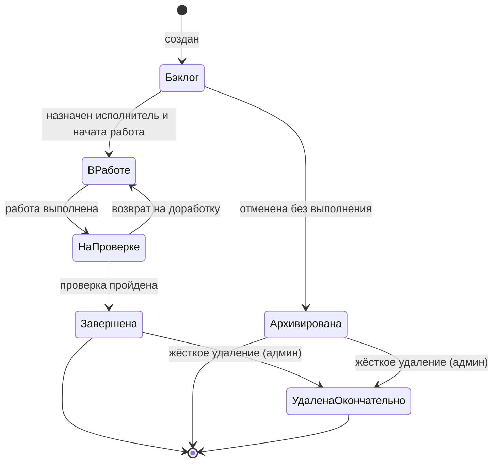
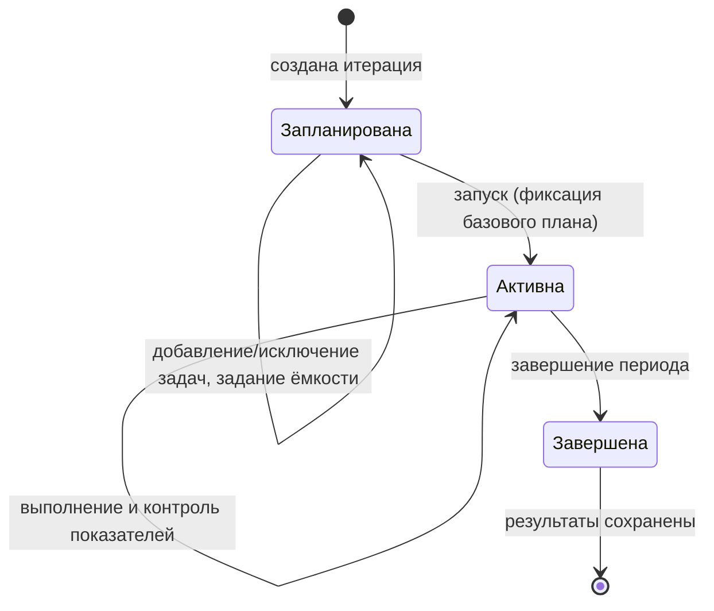
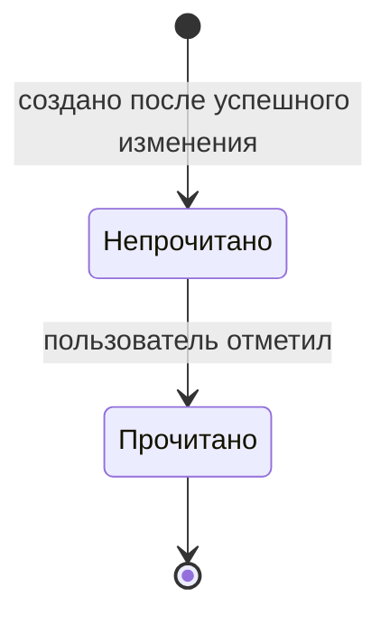

# 050 — Entities + Lifecycle

> Формат — см. [`../documents-composition.md`](../documents-composition.md#050--entities--lifecycle-050entitiesmd).
> Источник — [`../vision.md`](../vision.md). Продолжение [040 — Event Storming](040.event-storming.md);
> согласовано с [120 — Data Model](../block-f-data-model/120.data-model.md).

| Агрегат / сущность | Атрибуты | Связи |
|---|---|---|
| РабочийЭлемент | id (UUID), тип (enum: Проект/Эпик/Задача/Ошибка/Подзадача), наименование (обязательно), описание (markdown), статус, приоритет, исполнитель (внешний ID), дата начала, срок, плановая/фактическая/оставшаяся трудоёмкость (для листовых элементов — введены, для родителей — вычисляемая сумма), createdAt/updatedAt | N:1 к Статусу, Приоритету, Итерации; 1:N к самому себе (parent/children); 1:N к Комментарию, Вложению, ЗаписиТрудозатрат, ЗаписиИстории |
| Итерация | id, наименование, описание, дата начала, дата окончания, состояние (Запланирована/Активна/Завершена), базовый план (снимок на момент активации) | 1:N к РабочемуЭлементу; 1:N к ЁмкостиУчастника |
| ЁмкостьУчастника | итерация, внешний ID пользователя, доступные часы | N:1 к Итерации |
| ЗаписьТрудозатрат | id, рабочий элемент, внешний ID пользователя, дата, часы (≥ 0), комментарий (опционально) | N:1 к РабочемуЭлементу |
| Комментарий | id, рабочий элемент, автор (внешний ID), текст, createdAt | N:1 к РабочемуЭлементу |
| Вложение | id, рабочий элемент, имя файла, размер, тип содержимого, ссылка на хранилище, кем и когда загружено | N:1 к РабочемуЭлементу |
| ЗаписьИстории (аудит) | id, рабочий элемент, автор или внешний источник, occurredAt, изменённые поля, старые значения, новые значения | N:1 к РабочемуЭлементу |
| Уведомление | id, получатель (внешний ID), рабочий элемент (опционально), текст, createdAt, readAt (nullable) | N:1 к РабочемуЭлементу |
| Статус | id, наименование, порядок на доске, признак активности | 1:N к РабочемуЭлементу |
| Приоритет | id, наименование, порядок, признак активности | 1:N к РабочемуЭлементу |
| КэшПользователя (из справочника) | внешний ID, отображаемое имя, команда, подразделение, признак активности, время синхронизации | Используется как источник для поля «исполнитель» |

## Статусная модель рабочего элемента

Набор статусов настраивается администратором (см. [070 — RBAC](../block-c-requirements-and-roles/070.role-matrix.md)); ниже — представительный жизненный цикл.

Триггеры: переход между рабочими статусами — перемещение карточки на канбан-доске; переход в «Архивирована» — явное действие пользователя с правом; «УдаленаОкончательно» — отдельная защищённая операция, доступна только если у элемента нет дочерних.

## Жизненный цикл итерации

## Жизненный цикл уведомления

