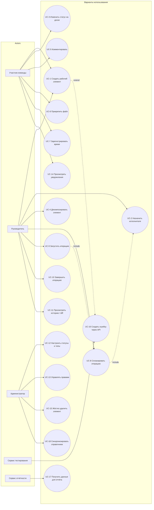

# 060 — Use Cases

> Формат — см. [`../documents-composition.md`](../documents-composition.md#060--use-cases-060use-casesmd).
> Источник — [`../vision.md`](../vision.md). Акторы — [030](030.actors.md); use case диаграмма
> использует `flowchart` вместо `usecaseDiagram` для гарантированного рендера в GitHub/Mermaid.

## Спецификации ключевых use case

**UC-1. Создать рабочий элемент**
- Актор: Участник команды, Руководитель.
- Предусловие: пользователь аутентифицирован и имеет право на создание элемента выбранного типа.
- Постусловие: элемент виден в бэклоге с уникальным идентификатором, начальным статусом и типом.
- Основной flow: 1) пользователь открывает форму создания → 2) выбирает тип и вводит обязательное наименование → 3) заполняет опциональные поля → 4) система сохраняет элемент и добавляет запись в историю.
- Альтернативный flow: наименование не заполнено → система отклоняет сохранение с указанием причины.

**UC-3. Изменить статус на канбан-доске**
- Актор: Участник команды.
- Предусловие: элемент виден пользователю на доске.
- Постусловие: новый статус сохранён, элемент отображается в соответствующей колонке, создана запись истории и уведомление исполнителю.
- Основной flow: 1) пользователь перетаскивает карточку в другую колонку → 2) система проверяет допустимость перехода → 3) сохраняет статус → 4) создаёт запись истории → 5) создаёт уведомление.
- Альтернативный flow: переход недопустим правилами процесса → карточка возвращается в исходную колонку с пояснением.

**UC-8. Спланировать итерацию** (include UC-2)
- Актор: Руководитель / планировщик.
- Предусловие: в бэклоге есть неназначенные в незавершённую итерацию задачи.
- Постусловие: итерация содержит согласованный состав задач в пределах доступной ёмкости.
- Основной flow: 1) создать итерацию с датами → 2) задать ёмкость участников → 3) отобрать задачи из бэклога → 4) назначить исполнителей (UC-2) → 5) система показывает нагрузку по каждому участнику и в целом.
- Альтернативная ветка: нагрузка превышает ёмкость → система показывает перегрузку, планировщик корректирует состав до запуска.

**UC-11. Просмотреть историю изменений (diff)**
- Актор: Руководитель, Участник команды (при наличии права просмотра).
- Предусловие: элемент имеет хотя бы одно изменение.
- Постусловие: пользователь видит хронологический список изменений.
- Основной flow: 1) открыть карточку → 2) перейти в блок истории → 3) выбрать запись → 4) система показывает предыдущие и новые значения с визуальным выделением различий.

**UC-15. Жёстко удалить элемент**
- Актор: Администратор.
- Предусловие: у элемента нет дочерних элементов.
- Постусловие: элемент и все зависимые данные (комментарии, вложения, трудозатраты, история) физически удалены, восстановление невозможно.
- Основной flow: 1) открыть элемент → 2) выбрать жёсткое удаление → 3) подтвердить действие → 4) система атомарно удаляет элемент и зависимые данные.
- Альтернативный flow: у элемента есть дочерние элементы → операция блокируется, система указывает, что нужно удалить или перенести дочерние элементы сначала.

**UC-16. [Внешняя система] Создать ошибку через API**
- Актор: Сервис тестирования.
- Предусловие: сервис аутентифицирован как сервисный клиент.
- Постусловие: создана задача типа «Ошибка» либо возвращена ссылка на ранее созданную (при повторном запросе).
- Основной flow: 1) сервис передаёт внешний ID дефекта, наименование, описание, серьёзность, окружение, ссылку на тест-кейс → 2) система проверяет обязательные поля и отсутствие дубликата по (источник, внешний ID) → 3) серьёзность конвертируется в приоритет → 4) создаётся задача, фиксируется источник в истории → 5) возвращается внутренний ID.
- Альтернативный flow: дубликат по внешнему ID → возвращается ссылка на существующую задачу без создания новой.
