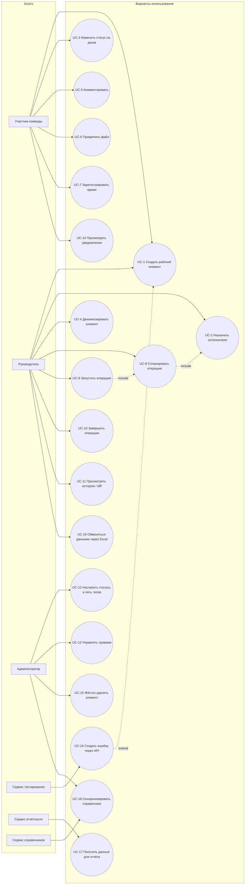

# 060 — Use Cases

> Формат — см. [`../documents-composition.md`](../documents-composition.md#060--use-cases-060use-casesmd).
> Источник — [`../vision.md`](../vision.md). Акторы — [030](../block-a-context-and-scope/030.actors.md); use case диаграмма
> использует `flowchart` вместо `usecaseDiagram` для гарантированного рендера в GitHub/Mermaid.

```mermaid
flowchart LR
    subgraph Actors
        M[Участник команды]
        L[Руководитель]
        A[Администратор]
        T[Сервис тестирования]
        R[Сервис отчётности]
        D[Сервис справочников]
    end

    subgraph UseCases["Варианты использования"]
        UC1((UC-1 Создать рабочий элемент))
        UC2((UC-2 Назначить исполнителя))
        UC3((UC-3 Изменить статус на доске))
        UC4((UC-4 Декомпозировать элемент))
        UC5((UC-5 Комментировать))
        UC6((UC-6 Прикрепить файл))
        UC7((UC-7 Зарегистрировать время))
        UC8((UC-8 Спланировать итерацию))
        UC9((UC-9 Запустить итерацию))
        UC10((UC-10 Завершить итерацию))
        UC11((UC-11 Просмотреть историю / diff))
        UC12((UC-12 Настроить статусы и пять типов))
        UC13((UC-13 Управлять правами))
        UC14((UC-14 Просмотреть уведомления))
        UC15((UC-15 Жёстко удалить элемент))
        UC16((UC-16 Создать ошибку через API))
        UC17((UC-17 Получить данные для отчёта))
        UC18((UC-18 Синхронизировать справочники))
        UC19((UC-19 Обменяться данными через Excel))
    end

    M --> UC1
    M --> UC3
    M --> UC5
    M --> UC6
    M --> UC7
    M --> UC14
    L --> UC1
    L --> UC2
    L --> UC4
    L --> UC8
    L --> UC9
    L --> UC10
    L --> UC11
    L --> UC19
    A --> UC12
    A --> UC13
    A --> UC15
    A --> UC18
    T --> UC16
    R --> UC17
    D --> UC18
    UC8 -.include.-> UC2
    UC9 -.include.-> UC8
    UC16 -.extend.-> UC1
```

## Спецификации вариантов использования

**UC-1. Создать рабочий элемент**
- Актор: Участник команды, Руководитель.
- Предусловие: пользователь аутентифицирован и имеет право на создание элемента выбранного типа.
- Постусловие: элемент виден в бэклоге с уникальным идентификатором, начальным статусом и типом.
- Основной поток: 1) пользователь открывает форму создания → 2) выбирает тип и вводит обязательное наименование → 3) заполняет опциональные поля → 4) система сохраняет элемент и добавляет запись в историю.
- Альтернативный поток: наименование не заполнено → система отклоняет сохранение с указанием причины.

**UC-3. Изменить статус на канбан-доске**
- Актор: Участник команды.
- Предусловие: элемент виден пользователю на доске.
- Постусловие: новый статус сохранён, элемент отображается в соответствующей колонке, создана запись истории и уведомление исполнителю.
- Основной поток: 1) пользователь перетаскивает карточку в другую колонку → 2) система проверяет допустимость перехода → 3) сохраняет статус → 4) создаёт запись истории → 5) создаёт уведомление.
- Альтернативный поток: переход недопустим правилами процесса → карточка возвращается в исходную колонку с пояснением.

**UC-8. Спланировать итерацию** (include UC-2)
- Актор: Руководитель / планировщик.
- Предусловие: в бэклоге есть неназначенные в незавершённую итерацию задачи.
- Постусловие: итерация содержит выбранный состав задач; нагрузка, свободный резерв и перегрузка явно рассчитаны до запуска.
- Основной поток: 1) создать итерацию с датами → 2) задать ёмкость участников → 3) отобрать задачи из бэклога → 4) назначить исполнителей (UC-2) → 5) система показывает нагрузку по каждому участнику и в целом.
- Альтернативная ветка: нагрузка превышает ёмкость → система показывает перегрузку; планировщик может скорректировать состав. Требование не вводит автоматический запрет запуска перегруженной итерации.

**UC-11. Просмотреть историю изменений (diff)**
- Актор: Руководитель, Участник команды (при наличии права просмотра).
- Предусловие: элемент имеет хотя бы одно изменение.
- Постусловие: пользователь видит хронологический список изменений.
- Основной поток: 1) открыть карточку → 2) перейти в блок истории → 3) выбрать запись → 4) система показывает предыдущие и новые значения с визуальным выделением различий.

**UC-15. Жёстко удалить элемент**
- Актор: Администратор.
- Предусловие: у элемента нет дочерних элементов.
- Постусловие: элемент и все зависимые данные (комментарии, вложения, трудозатраты, история) физически удалены, восстановление невозможно.
- Основной поток: 1) открыть элемент → 2) выбрать жёсткое удаление → 3) подтвердить действие → 4) система атомарно удаляет элемент и зависимые данные.
- Альтернативный поток: у элемента есть дочерние элементы → операция блокируется, система указывает, что нужно удалить или перенести дочерние элементы сначала.

**UC-16. [Внешняя система] Создать ошибку через API**
- Актор: Сервис тестирования.
- Предусловие: сервис аутентифицирован как сервисный клиент.
- Постусловие: создана задача типа «Ошибка» либо возвращена ссылка на ранее созданную (при повторном запросе).
- Основной поток: 1) сервис передаёт внешний ID дефекта, наименование, описание, серьёзность, окружение, ссылку на тест-кейс → 2) система проверяет обязательные поля и отсутствие дубликата по (источник, внешний ID) → 3) серьёзность конвертируется в приоритет → 4) создаётся задача, фиксируется источник в истории → 5) возвращается внутренний ID.
- Альтернативный поток: дубликат по внешнему ID → возвращается ссылка на существующую задачу без создания новой.

**UC-19. Обменяться данными через Excel**
- Актор: Руководитель / планировщик (право экспорта/импорта, см. [070](../block-c-requirements-and-roles/070.role-matrix.md)).
- Предусловие: у пользователя есть право на экспорт/импорт; для импорта — ранее экспортированный системой файл `.xlsx`.
- Постусловие: файл экспортирован либо рабочие элементы созданы/обновлены по данным корректного файла.
- Основной поток: 1) пользователь запрашивает экспорт → 2) система формирует `.xlsx` с идентификаторами и связанными справочными значениями → 3) пользователь изменяет файл и загружает его обратно → 4) система проверяет структуру, обязательные поля и ссылки → 5) создаёт новые и обновляет существующие элементы по идентификатору → 6) показывает отчёт с числом созданных, обновлённых и отклонённых записей.
- Альтернативный поток: файл не проходит проверку → импорт не применяется частично, пользователь получает перечень ошибок.

**UC-2. Назначить исполнителя**
- Актор: Руководитель.
- Предусловие: Элемент доступен; сотрудник активен в кэше; плановое назначение связанного элемента меняется в Planning System.
- Постусловие: Назначение сохранено, есть аудит и уведомление.
- Основной поток: Выбрать активного сотрудника → проверить право и владение полем → сохранить в транзакции.
- Альтернативный поток: Неактивный сотрудник — 422; плановое поле — 409; rollback не создаёт уведомления.

**UC-4. Декомпозировать работу**
- Актор: Руководитель.
- Предусловие: Есть родитель допустимого типа и право создания.
- Постусловие: Создан дочерний элемент, суммы родителя пересчитаны.
- Основной поток: Открыть родителя → выбрать допустимый тип → создать → пересчитать листовые оценки.
- Альтернативный поток: Цикл/неверный тип — 422; проект и эпик создаются только через планирование.

**UC-5. Работать с комментариями**
- Актор: Участник.
- Предусловие: Есть доступ к карточке и право comment.create; чужой комментарий требует comment.manage.
- Постусловие: Комментарий сохранён/изменён/удалён; есть история и уведомление.
- Основной поток: Открыть обсуждение → ввести текст → проверить авторство/права → сохранить транзакционно.
- Альтернативный поток: Пустой текст — 422; чужой комментарий без права — 403.

**UC-6. Работать с вложениями**
- Актор: Участник.
- Предусловие: Есть доступ к карточке; размер и MIME допустимы.
- Постусловие: Метаданные в БД, содержимое в приватном MinIO; удаление поставлено в cleanup.
- Основной поток: Зарезервировать cleanup key → upload → сохранить метаданные/аудит → download через API после проверки доступа.
- Альтернативный поток: Недоступность S3 — 503; rollback upload оставляет reservation для очистки; запрещённый MIME — 422.

**UC-7. Зарегистрировать время**
- Актор: Участник.
- Предусловие: Элемент — исполнимый лист; есть time.create.
- Постусловие: Запись времени, аудит, уведомление и outbox сохранены; остаток пересчитан.
- Основной поток: Ввести дату и положительные часы → проверить лист/права → сохранить → показать факт/остаток.
- Альтернативный поток: Родитель/нулевые часы/более двух знаков — 422; перерасход допускается как отрицательный остаток.

**UC-9. Запустить итерацию**
- Актор: Руководитель.
- Предусловие: Итерация PLANNED; есть iteration.write.
- Постусловие: ACTIVE и неизменяемый baseline; outbox IterationActivated.
- Основной поток: Проверить предупреждения ёмкости → заблокировать строку → снять metrics → сохранить baseline.
- Альтернативный поток: Повтор/иная стадия — 409; предупреждение перегрузки не является автоматическим запретом.

**UC-10. Завершить итерацию**
- Актор: Руководитель.
- Предусловие: Итерация ACTIVE.
- Постусловие: Сохранены result и план-факт; нет текущего членства в незавершённой итерации.
- Основной поток: Заблокировать строку → снять результат → сравнить с baseline → COMPLETED → показать итог.
- Альтернативный поток: Не ACTIVE — 409; baseline не перезаписывается; незавершённые задачи доступны для новой итерации.

**UC-12. Настроить статусы**
- Актор: Администратор.
- Предусловие: Есть status.admin; категория OPEN/COMPLETED/ARCHIVED.
- Постусловие: Настройка сохранена; колонки соответствуют активным boardVisible.
- Основной поток: Создать/переименовать/поменять порядок или категорию → проверить ссылки → сохранить.
- Альтернативный поток: Недопустимая категория — 422; нарушение уникальности/ограничения — 409.

**UC-13. Настроить доступ и права**
- Актор: Администратор.
- Предусловие: Есть access.admin; HR-профиль и JWT принадлежат внешним системам.
- Постусловие: Обновлён local_access/role_permission.
- Основной поток: Выбрать пользователя/роль → настроить допуск или разрешение → сервер проверяет каждую операцию.
- Альтернативный поток: Без права — 403; изменение UI не обходится прямым API; сервисный клиент не получает человеческий допуск.

**UC-14. Прочитать уведомления**
- Актор: Участник.
- Предусловие: Есть notifications.read.
- Постусловие: Видны только свои уведомления, отметка read_at идемпотентна.
- Основной поток: Загрузить список → открыть карточку или отметить прочтение.
- Альтернативный поток: Чужой/отсутствующий ID — 404; удалённый элемент отображается snapshot без перехода.

**UC-17. Прочитать данные для интеграции**
- Актор: Reports / QA / Planning System.
- Предусловие: JWT с разрешённой сервисной ролью.
- Постусловие: Получена страница задач/итераций/времени/истории без изменяющих прав.
- Основной поток: Задать фильтры → проверить роль → SQL фильтры/count/LIMIT/OFFSET → вернуть страницу.
- Альтернативный поток: Недостаточная роль — 403; неверные даты/страница — 422; полный обход не обещает единый snapshot.

**UC-18. Синхронизировать оргсправочники**
- Актор: Администратор / расписание.
- Предусловие: Настроен Reference Manager URL и сервисный токен.
- Постусловие: Все страницы проверены; кэш заменён атомарно; неактивные сохранены.
- Основной поток: Прочитать employees/org_units → проверить идентичность/ссылки → заменить кэш → записать метаданные и событие.
- Альтернативный поток: Timeout/ошибка промежуточной страницы/цикл token — старый кэш остаётся, фиксируется отказ.

**UC-20. Опубликовать план и получить факт**
- Актор: Planning System.
- Предусловие: JWT planning-service; согласованный draft и положительная версия.
- Постусловие: Upsert проекций в одной транзакции; факт доступен; retirement сохраняет историю.
- Основной поток: PUT проект/эпики/задачи → проверка версии и ID → commit/outbox → GET facts.
- Альтернативный поток: Та же версия/JSON — already-applied; изменённый/устаревший пакет — 409; ошибка элемента откатывает всё.

**UC-21. Доставить событие и сверить витрину**
- Актор: Reports / outbox publisher.
- Предусловие: Изменение committed; топик и доступ настроены.
- Постусловие: Событие доставлено at-least-once, витрина сверена у потребителя.
- Основной поток: Прочитать первую pending запись агрегата → ACK Kafka → commit отметки → Reports дедуплицирует eventId.
- Альтернативный поток: Ошибка — retry/backoff; DEAD блокирует агрегат до admin replay; повтор ACK/commit не учитывается дважды.
