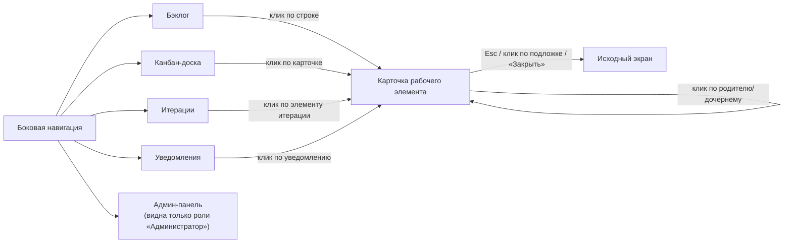

# 115 — Live-прототип

> Формат — см. [`../documents-composition.md`](../documents-composition.md#115--live-прототип-115live-prototypemd).
> См. также [110 — UI/UX прототип](110.ui-ux.md).

Интерактивный HTML-прототип создан и находится в
[`../../frontend/prototype/`](../../frontend/prototype/) — один `index.html` с навигацией между
экранами (без сборки и внешних зависимостей, открывается прямо в браузере). Подробности и список
сознательных упрощений — в [`frontend/prototype/README.md`](../../frontend/prototype/README.md).

## Экраны и связки между ними

Экраны соответствуют [110](110.ui-ux.md): Бэклог, Канбан-доска, Итерации, Уведомления,
Админ-панель — постоянно доступны через боковую навигацию — и Карточка рабочего элемента,
открывающаяся диалогом поверх любого экрана.

Переключатель роли в сайдбаре («Участник команды» / «Руководитель» / «Администратор») сразу
меняет доступные действия: импорт/экспорт показывается руководителю, создание элемента —
участнику и руководителю, а админ-панель и жёсткое удаление — администратору. Это демонстрация
ключевых контекстных ограничений из [110](110.ui-ux.md) и проектной [матрицы ролей](../block-c-requirements-and-roles/070.role-matrix.md),
без реальной проверки на сервере (в проде это делает бэкенд, см. [NFR-003](../block-c-requirements-and-roles/075.nfr.md)).

## Проверенные сценарии

Прогнаны через headless Chrome (Playwright), без ошибок в консоли:

- открытие карточки рабочего элемента, созданного сервисом тестирования (`TT-7`), просмотр её
  истории изменений в формате diff — UC-11, UC-16;
- регистрация трудозатрат и добавление комментария в карточке — UC-7, US-M3;
- перенос карточки на канбан-доске мышью или клавишами ←/→ со сменой статуса, включая отклонение переноса
  элемента без исполнителя за пределы бэклога (error-состояние из 110) — UC-3;
- переключение между итерациями и просмотр план-факта по завершённой итерации — UC-9, UC-10,
  US-L3;
- переход по клику на уведомление в связанную карточку, закрытие карточки по Esc — UC-14;
- экспорт в Excel (реальное скачивание CSV с текущими данными) и оба сценария импорта — успешный
  и отклонённый с отчётом об ошибках, без частичного применения — UC-19, US-L5;
- переключение роли на «Участник команды» и обратно на «Администратор» со скрытием/показом
  админ-панели — UC-12, UC-13;
- запуск синхронизации со справочником с симуляцией как успеха, так и недоступности сервиса —
  UC-18.
- жёсткое удаление листового элемента администратором: зависимые данные и история исчезают,
  уведомления сохраняются со снимком ID/наименования и без ссылки на удалённую карточку — US-A2.

## Расхождения с 110/060, оставленные сознательно

- Канбан-доска показывает только исполнимые типы (Задача/Ошибка/Подзадача); Проекты и Эпики
  видны в Бэклоге, но не выводятся отдельными карточками на доске — упрощение, не описанное явно
  в 110, но не противоречащее ему.
- Импорт не парсит настоящий `.xlsx` — это макет интерфейса и сценариев, а не рабочий парсер
  файлов; см. полный список упрощений в `frontend/prototype/README.md`.
- Состояния загрузки, предпросмотр содержимого вложений, редактирование локального допуска и
  прав, а также просмотр синхронизированных оргданных не реализованы: прототип показывает
  целевые точки входа и основные состояния, но не заменяет полноценный frontend.
- Членство элемента в итерации представлено текущим `iterationId` в памяти; историческая M:N
  модель из [120](../block-f-data-model/120.data-model.md) относится к реализации backend и БД.
