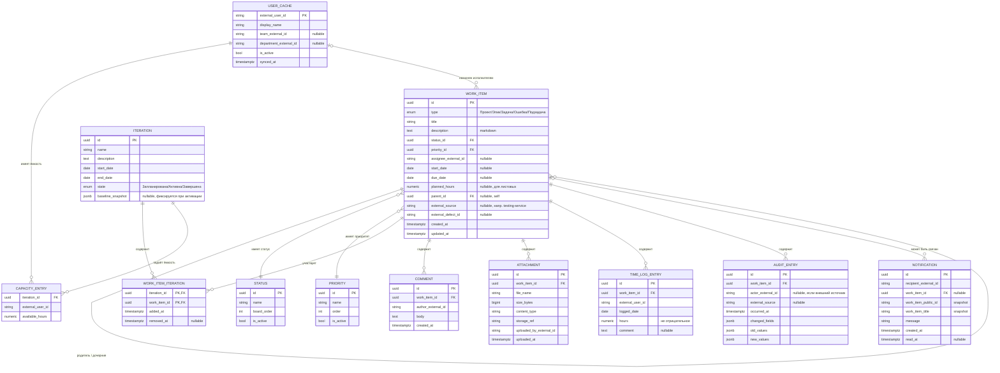

# 120 — Data Model

> Формат — см. [`../documents-composition.md`](../documents-composition.md#120--data-model-120data-modelmd).
> Согласовано с сущностями/агрегатами из [050](../block-b-domain-analysis/050.entities.md).

**Ограничения и индексы:**
- Сущности с полем `id` используют UUID PK; `CAPACITY_ENTRY` имеет составной PK (`iteration_id`, `external_user_id`), `WORK_ITEM_ITERATION` — (`iteration_id`, `work_item_id`), `USER_CACHE` — внешний ID пользователя.
- `WORK_ITEM_ITERATION` имеет составной PK (`iteration_id`, `work_item_id`). Активное членство задаётся `removed_at IS NULL`; транзакционная проверка запрещает более одного активного членства в незавершённых итерациях, но сохраняет историю завершённых итераций.
- Уникальный индекс `(external_source, external_defect_id)` на `WORK_ITEM` — для идемпотентности создания ошибок сервисом тестирования (BR-008, см. [095](../block-d-verification/095.requirements-check.md)).
- Индексы на `status_id`, `priority_id`, `parent_id`, `assignee_external_id` и обе стороны `WORK_ITEM_ITERATION` — под фильтрацию бэклога, канбан-доски и истории итераций.
- `planned_hours` и `hours` в `TIME_LOG_ENTRY` — ограничение `>= 0`.
- `due_date >= start_date` — проверка на уровне приложения и/или CHECK-ограничения.
- Частичный индекс по активным статусам/приоритетам (`WHERE is_active`) — для быстрой фильтрации доски.

| Таблица | Обязательные и ссылочные ограничения |
|---|---|
| `WORK_ITEM` | `type`, `title`, `status_id`, `priority_id`, `created_at`, `updated_at` — NOT NULL; `parent_id` — FK RESTRICT; допустимый уровень и отсутствие цикла проверяются транзакционно |
| `STATUS`, `PRIORITY` | имя, порядок и active — NOT NULL; физическое удаление используемого значения запрещено, вместо него применяется деактивация |
| `ITERATION` | `name`, даты и `state` — NOT NULL; `end_date >= start_date`; baseline после активации неизменяем |
| `WORK_ITEM_ITERATION` | обе FK и `added_at` — NOT NULL; удаление элемента каскадирует членство, удаление итерации с историей запрещено |
| `USER_CACHE` | внешний ID, имя, active, synced_at — NOT NULL; значения изменяет только синхронизация; назначение ссылается на кэш логическим FK RESTRICT, inactive сохраняется для истории |
| `COMMENT`, `ATTACHMENT`, `TIME_LOG_ENTRY`, `AUDIT_ENTRY` | FK на элемент — NOT NULL; зависимые записи удаляются вместе с элементом |
| `NOTIFICATION` | получатель, snapshot ID/title, текст и created_at — NOT NULL; FK на элемент nullable с `ON DELETE SET NULL` |

**Каскады:** жёсткое удаление `WORK_ITEM` каскадно удаляет `COMMENT`, `ATTACHMENT`, `TIME_LOG_ENTRY`, `AUDIT_ENTRY` и членство в итерациях, но блокируется при наличии дочерних `WORK_ITEM`. `NOTIFICATION` не удаляется: ссылка получает `NULL`, а snapshot ID/наименования позволяет сохранить уведомление об удалении. Архивирование каскадов не вызывает.

**Примечания по бизнес-логике:** `actual_hours` и `remaining_hours` не являются колонками `WORK_ITEM`: они вычисляются как сумма `TIME_LOG_ENTRY` и `planned_hours − actual_hours`. Для родителей все три показателя агрегируются по листовым потомкам. `baseline_snapshot` — неизменяемый JSONB-снимок состава и оценок при активации; фактическая история состава хранится в `WORK_ITEM_ITERATION`, поэтому перенос элемента в следующую итерацию не уничтожает данные завершённой.

**Согласование с [050](../block-b-domain-analysis/050.entities.md):** все сущности из 050 отражены в ER-модели. `USER_CACHE` хранит последнюю успешную версию справочника и не редактируется средствами Task Tracker; точный внешний контракт остаётся открытым вопросом системных требований.
