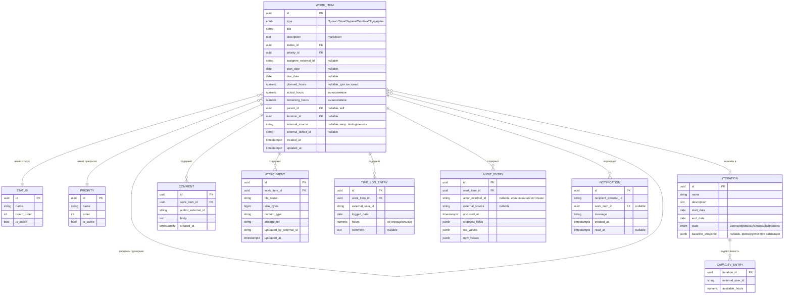

# 120 — Data Model

> Формат — см. [`../documents-composition.md`](../documents-composition.md#120--data-model-120data-modelmd).
> Согласовано с сущностями/агрегатами из [050](050.entities.md).

**Ограничения и индексы:**
- PK на всех таблицах — `id` (UUID); `CAPACITY_ENTRY` — составной PK (`iteration_id`, `external_user_id`).
- Уникальный индекс `(external_source, external_defect_id)` на `WORK_ITEM` — для идемпотентности создания ошибок сервисом тестирования (BR-011, см. [095](095.requirements-check.md)).
- Индексы на `status_id`, `priority_id`, `iteration_id`, `parent_id`, `assignee_external_id` — под фильтрацию бэклога и канбан-доски.
- `planned_hours` и `hours` в `TIME_LOG_ENTRY` — ограничение `>= 0`.
- `due_date >= start_date` — проверка на уровне приложения и/или CHECK-ограничения.
- Частичный индекс по активным статусам/приоритетам (`WHERE is_active`) — для быстрой фильтрации доски.

**Каскады:** жёсткое удаление `WORK_ITEM` каскадно удаляет `COMMENT`, `ATTACHMENT`, `TIME_LOG_ENTRY`, `AUDIT_ENTRY`, `NOTIFICATION` этого элемента, но блокируется на уровне приложения при наличии дочерних `WORK_ITEM` (BR-010). Архивирование (перевод в статус) каскадов не вызывает.

**Примечания по бизнес-логике:** `actual_hours` и `remaining_hours` — вычисляемые поля (сумма `TIME_LOG_ENTRY` и `planned_hours − actual_hours` соответственно), не хранятся как независимый ввод пользователя (BR-008); для родительских элементов (`Проект`, `Эпик`, родительская `Задача`) плановая/фактическая/оставшаяся трудоёмкость — агрегат по дочерним листовым элементам, а не собственное поле (BR-004). `baseline_snapshot` в `ITERATION` — JSONB со слепком состава и оценок на момент активации (BR-007).

**Согласование с [050](050.entities.md):** таблицы соответствуют агрегатам один в один; `КэшПользователя` намеренно не выделен отдельной сущностью в этой модели — реализуется как read-through кэш поверх сервиса справочников (детали — предмет отдельной задачи после согласования с этим сервисом, см. `../../CLAUDE.md`).
