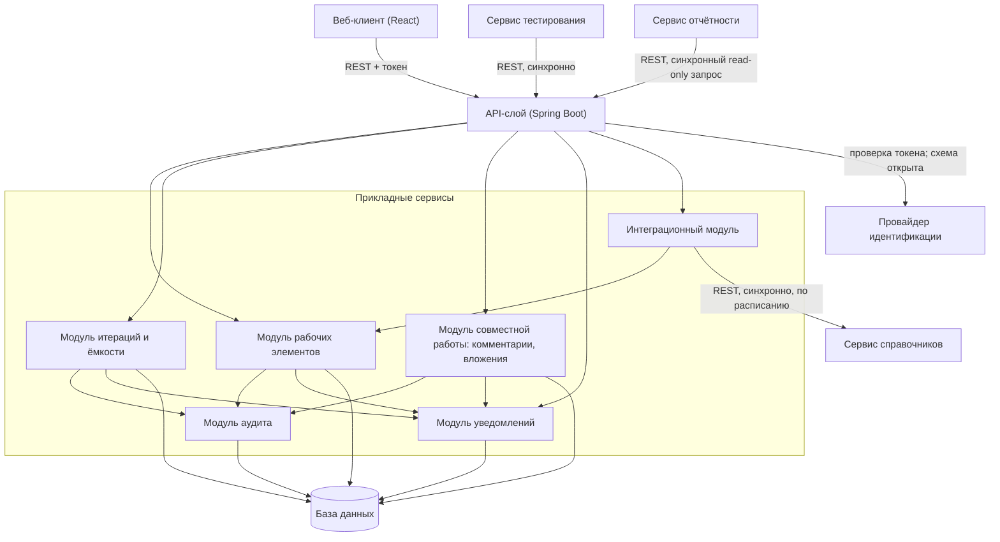

# 146 — Logic Scheme

> Формат — см. [`../documents-composition.md`](../documents-composition.md#146--logic-scheme-146logic-schememd).
> Детализация компонентов — [150](150.component-diagram.md).

Все внешние взаимодействия — синхронные REST-вызовы: сервис тестирования и сервис отчётности вызывают Task Tracker, а Task Tracker вызывает сервис справочников. Сервер проверяет токен и права, но конкретный IdP/способ проверки остаётся открытым. Аудит и уведомления записываются транзакционно внутри приложения; внешней шины сообщений нет (ADR-004, ADR-007).
