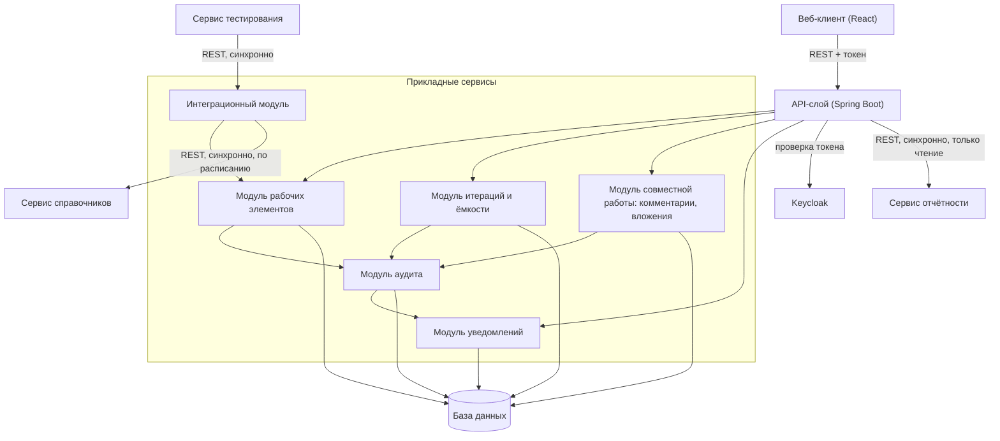

# 146 — Logic Scheme

> Формат — см. [`../documents-composition.md`](../documents-composition.md#146--logic-scheme-146logic-schememd).
> Детализация компонентов — [150](150.component-diagram.md).

Все внешние взаимодействия — синхронные REST-вызовы (авторизация через Keycloak на каждый запрос, вызов сервиса тестирования — входящий, вызов сервиса отчётности — исходящий ответ, синхронизация справочников — исходящий вызов по расписанию). Асинхронного обмена через шину сообщений в границах модуля на сегодня нет (см. [ADR-004](145.architecture-decisions.md)).
