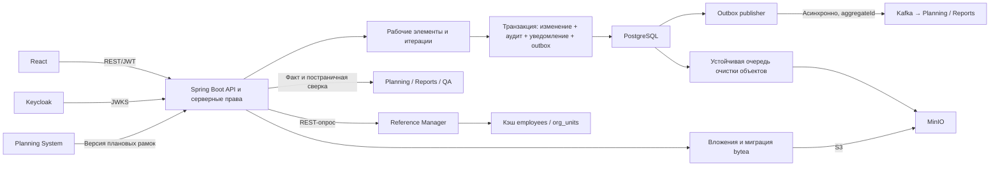

# 146 — Логическая схема

Целевая проектная схема; новые интеграционные компоненты описаны для согласования и последующей реализации по плану 160.

```mermaid
flowchart LR
    UI["React"] -->|"REST/JWT"| API["Spring Boot API и серверные права"]
    KC["Keycloak"] -->|"JWKS"| API
    PS["Planning System"] -->|"Версия плановых рамок"| API
    API --> Work["Рабочие элементы и итерации"]
    Work --> TX["Транзакция: изменение + аудит + уведомление + outbox"]
    TX --> DB["PostgreSQL"]
    DB --> Publisher["Outbox publisher"]
    Publisher -->|"Асинхронно, aggregateId"| Kafka["Kafka → Planning / Reports"]
    API -->|"Факт и постраничная сверка"| Consumers["Planning / Reports / QA"]
    API -->|"REST-опрос"| RM["Reference Manager"]
    RM --> Cache["Кэш employees / org_units"]
    API --> Storage["Вложения и миграция bytea"]
    Storage -->|"S3"| Minio["MinIO"]
    DB --> Cleanup["Устойчивая очередь очистки объектов"]
    Cleanup --> Minio
```

REST синхронен; Kafka отправляется после commit и допускает повтор; ETL выполняется Reports пакетно через API. Аудит и встроенное уведомление атомарны с изменением. S3 и Kafka не участвуют в общей транзакции с PostgreSQL. [145 ADR](145.architecture-decisions.md), [162 решения](../block-i-integration-and-deployment/162.integration-spec.md).
