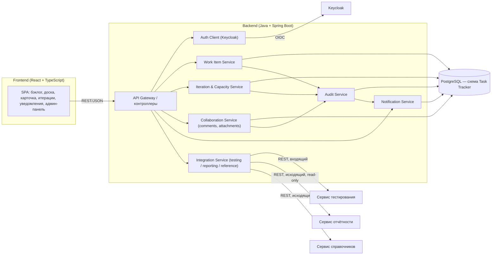

# 150 — Component Diagram

> Формат — см. [`../documents-composition.md`](../documents-composition.md#150--component-diagram-150component-diagrammd).
> Расширяет [146 Logic Scheme](146.logic-scheme.md); узлы деплоя — [165](165.deployment-diagram.md).

| Компонент | Технология | Ответственность |
|---|---|---|
| SPA | React + TypeScript | Бэклог, доска, карточка, итерации, уведомления, админ-панель |
| API Gateway | Spring Boot (REST) | Маршрутизация, проверка токена, форматирование ошибок |
| Work Item Service | Spring Boot | CRUD рабочих элементов, иерархия, жёсткое удаление |
| Iteration & Capacity Service | Spring Boot | Итерации, ёмкость, базовый план, план-факт |
| Collaboration Service | Spring Boot | Комментарии, вложения |
| Audit Service | Spring Boot | Запись истории, построение diff |
| Notification Service | Spring Boot | Создание и выдача уведомлений |
| Integration Service | Spring Boot | Контракты с сервисом тестирования, отчётности, справочников; идемпотентность, кэш |
| PostgreSQL | СУБД | Хранение данных Task Tracker (пара с приложением, см. `../../../core/README.md`) |

Связь с [145 ADR](145.architecture-decisions.md): ADR-001 (единая таблица), ADR-002 (уведомления без внешнего канала), ADR-004 (Integration Service — только синхронный REST), ADR-006 (кэш в Integration Service).
