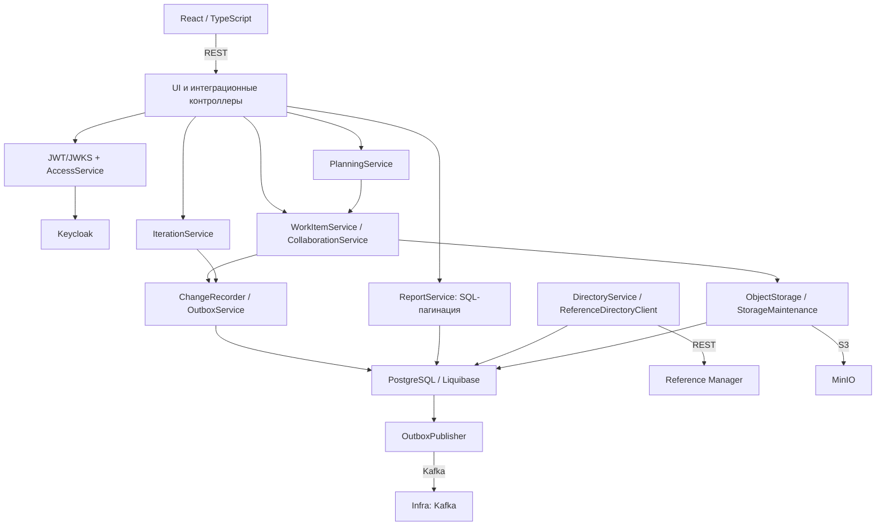

# 150 — Компоненты Task Tracker

Целевая проектная схема; новые интеграционные компоненты описаны для согласования и последующей реализации по плану 160.

```mermaid
flowchart TB
    UI["React / TypeScript"] -->|"REST"| Controllers["UI и интеграционные контроллеры"]
    Controllers --> Access["JWT/JWKS + AccessService"]
    Access --> KC["Keycloak"]
    Controllers --> Work["WorkItemService / CollaborationService"]
    Controllers --> Iteration["IterationService"]
    Controllers --> Plan["PlanningService"]
    Controllers --> Reports["ReportService: SQL-пагинация"]
    Work --> Changes["ChangeRecorder / OutboxService"]
    Iteration --> Changes
    Plan --> Work
    Changes --> DB["PostgreSQL / Liquibase"]
    Reports --> DB
    Directory["DirectoryService / ReferenceDirectoryClient"] -->|"REST"| RM["Reference Manager"]
    Directory --> DB
    Work --> Storage["ObjectStorage / StorageMaintenance"]
    Storage -->|"S3"| Minio["MinIO"]
    Storage --> DB
    DB --> Publisher["OutboxPublisher"]
    Publisher -->|"Kafka"| Broker["Infra: Kafka"]
```

| Компонент | Технология / ответственность |
|---|---|
| UI | React/TypeScript, OIDC/PKCE, состояния загрузки/пустоты/ошибки |
| API и AccessService | Spring Boot, JWT issuer/audience, локальный допуск людей, отдельные роли сервисов |
| Рабочие элементы / совместная работа | Иерархия, оценки, комментарии, время, защищённые файлы |
| Итерации | Ёмкость, неизменяемый baseline, завершение и план-факт |
| PlanningService | Проекции, внешние ID, версии, идемпотентность, retirement |
| ReportService | Постраничные факты/итерации/время/история для Reports, QA и Planning |
| DirectoryService | Полная проверяемая загрузка коллекций до замены кэша |
| ChangeRecorder / OutboxService / publisher | Атомарный аудит/уведомления/outbox; ACK, retry и dead-letter |
| ObjectStorage / maintenance | S3, SHA-256 миграции bytea, очистка после rollback/удаления |

Интерфейсы — [130](../block-g-api-and-events/130.api-contracts.md), решения — [145](145.architecture-decisions.md), развёртывание — [165](../block-i-integration-and-deployment/165.deployment-diagram.md).
