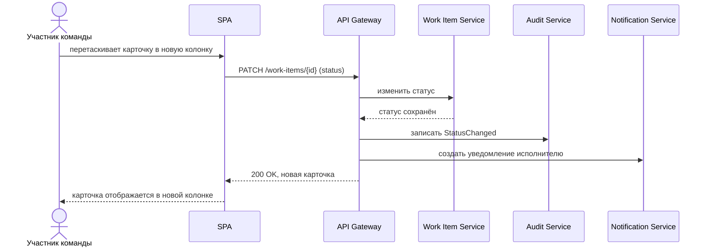
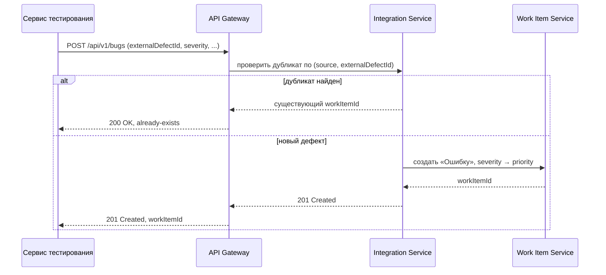
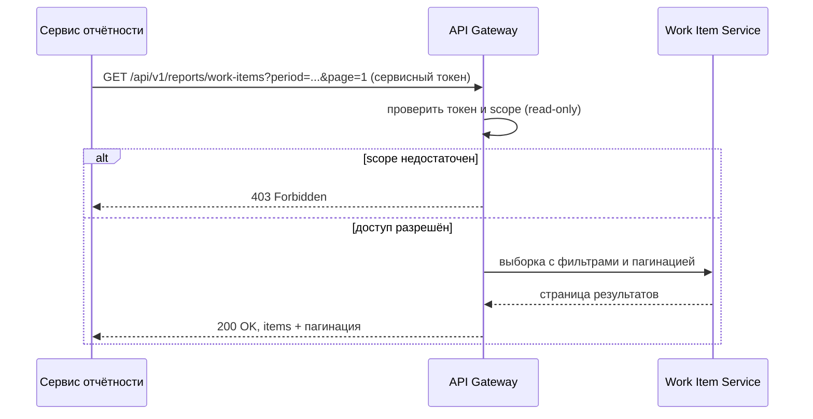
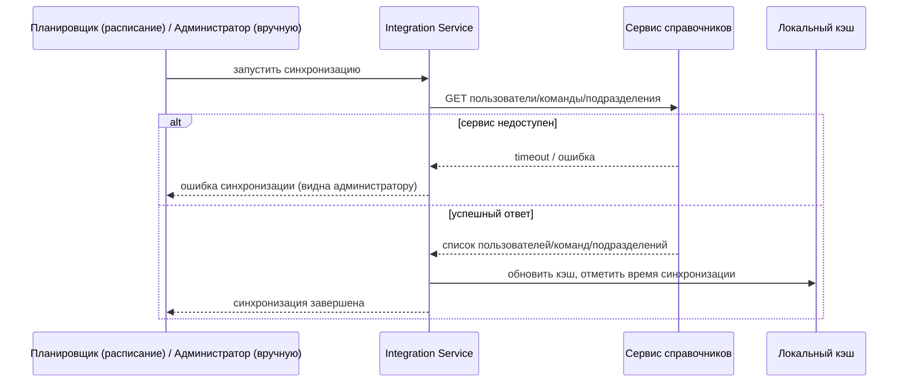

# 155 — Sequence-диаграммы

> Формат — см. [`../documents-composition.md`](../documents-composition.md#155--sequence-диаграммы-155sequence-diagramsmd).
> Привязаны к use cases — [060](060.use-cases.md) — и контрактам — [130](130.api-contracts.md).

## Изменение статуса на канбан-доске

## Сервис тестирования создаёт ошибку

## Сервис отчётности запрашивает данные

## Синхронизация справочника пользователей

