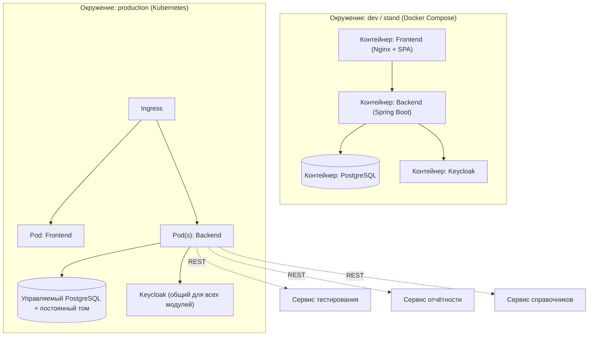

# 165 — Deployment Diagram

> Формат — см. [`../documents-composition.md`](../documents-composition.md#165--deployment-diagram-165deployment-diagrammd).
> Узлы соответствуют компонентам из [150](150.component-diagram.md).

| Узел | Соответствие компоненту ([150](150.component-diagram.md)) |
|---|---|
| Контейнер/под Frontend | SPA |
| Контейнер/под Backend | API Gateway + Work Item / Iteration / Collaboration / Audit / Notification / Integration Service |
| Контейнер PostgreSQL | Хранилище данных Task Tracker |
| Keycloak | Auth Client (внешняя зависимость, общая для всех модулей) |

Окружения соответствуют модели `../../../infra/README.md`: `compose.yaml` + `compose.dev.yaml` — для dev/стенда, конфигурация Kubernetes — для эксплуатационных окружений (на сегодня не реализована ни там, ни там — оба являются заготовками, см. `../../CLAUDE.md`).
