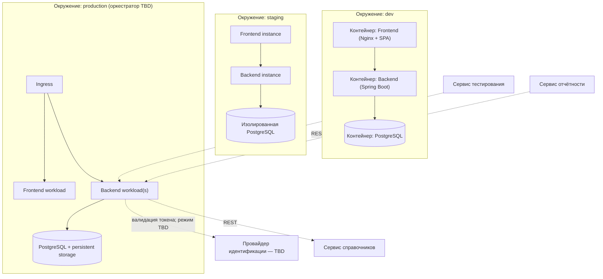

# 165 — Deployment Diagram

> Формат — см. [`../documents-composition.md`](../documents-composition.md#165--deployment-diagram-165deployment-diagrammd).
> Узлы соответствуют компонентам из [150](../block-h-architecture-and-logic/150.component-diagram.md).

Диаграмма — **кандидатная**, а не утверждённая production-топология. Она показывает маппинг компонентов и три требуемых окружения; оркестратор, провайдер идентификации, HA и параметры хранилищ утверждаются после закрытия вопросов SR 11/NFR-008.

| Узел | Соответствие компоненту ([150](../block-h-architecture-and-logic/150.component-diagram.md)) |
|---|---|
| Frontend container/instance/workload | SPA |
| Backend container/instance/workload | API Gateway + Work Item / Iteration / Collaboration / Audit / Notification / Integration Service + Auth adapter |
| PostgreSQL каждого окружения | Хранилище данных Task Tracker; окружения изолированы |
| Внешний IdP | Провайдер для Auth adapter; конкретная реализация открыта |

Dev может использовать существующие `../../../compose.yaml` и `../../../compose.dev.yaml`. Staging должен повторять production-конфигурацию настолько, насколько необходимо для интеграционных и миграционных проверок. Production-оркестратор, резервное копирование, RPO/RTO, HA и сетевые границы нельзя считать утверждёнными до закрытия NFR-008.
