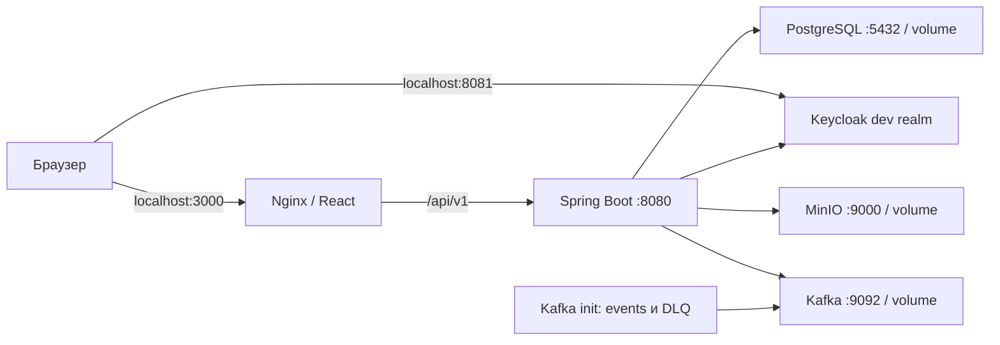
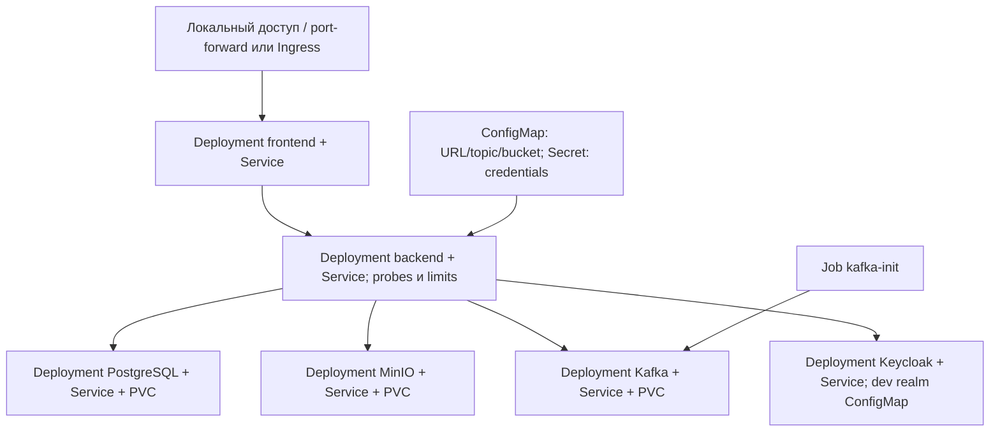

# 165 — Развёртывание

## Целевая локальная среда Compose

```mermaid
flowchart LR
    Browser["Браузер"] -->|"localhost:3000"| UI["Nginx / React"]
    Browser -->|"localhost:8081"| KC["Keycloak dev realm"]
    UI -->|"/api/v1"| API["Spring Boot :8080"]
    API --> PG["PostgreSQL :5432 / volume"]
    API --> KC
    API --> S3["MinIO :9000 / volume"]
    API --> Kafka["Kafka :9092 / volume"]
    Init["Kafka init: events и DLQ"] --> Kafka
```

Целевая конфигурация Compose должна запускать отдельную dev-сеть и named volumes БД/объектов/событий. Публикуемые порты привязаны к loopback. MinIO собирается из фиксированного исходного commit согласно Infra ADR-003; bucket должен создаваться в демонстрационной среде. Это отдельный учебный realm, не общий Keycloak команды Infra. Dev-пароли не подходят для production.

## Локальный Kubernetes

```mermaid
flowchart TB
    Host["Локальный доступ / port-forward или Ingress"] --> UI["Deployment frontend + Service"]
    UI --> API["Deployment backend + Service; probes и limits"]
    API --> PG["Deployment PostgreSQL + Service + PVC"]
    API --> S3["Deployment MinIO + Service + PVC"]
    API --> Kafka["Deployment Kafka + Service + PVC"]
    API --> KC["Deployment Keycloak + Service; dev realm ConfigMap"]
    Config["ConfigMap: URL/topic/bucket; Secret: credentials"] --> API
    Init["Job kafka-init"] --> Kafka
```

Это проектная схема финального этапа: Deployment, Service, ConfigMap, Secret, PVC, probes, limits и маршрутизация. Манифесты и проверка запуска должны быть подготовлены на И-M5. Backend/frontend используют собранные версионированные образы; PVC сохраняются при замене pods. Реплика каждого stateful-сервиса одна, стратегия Recreate, HA не заявляется. Общий staging предоставляется Infra; production-топология, резервирование и численные RPO/RTO утверждаются по NFR-008, а не выводятся из этой схемы.
