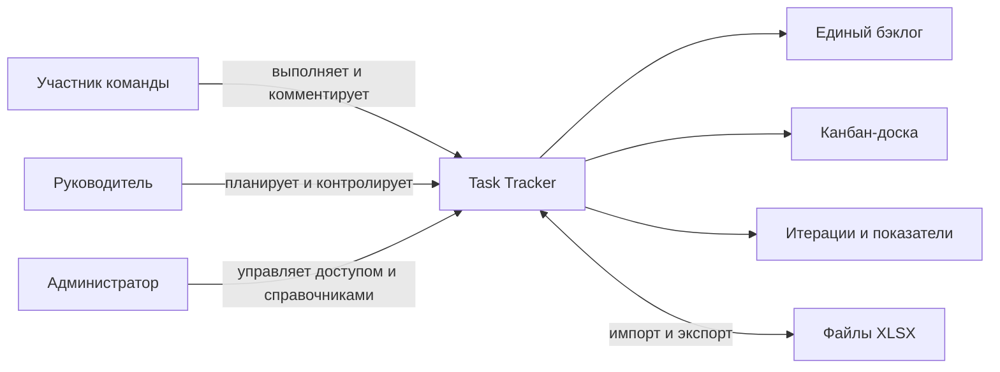
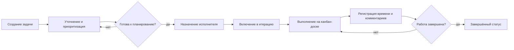
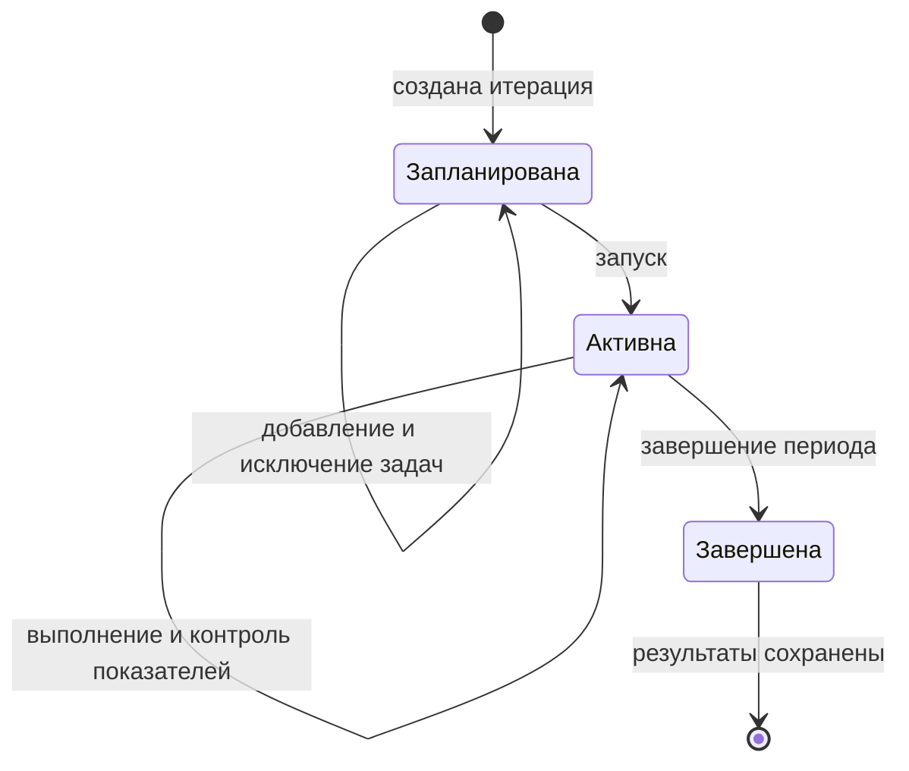
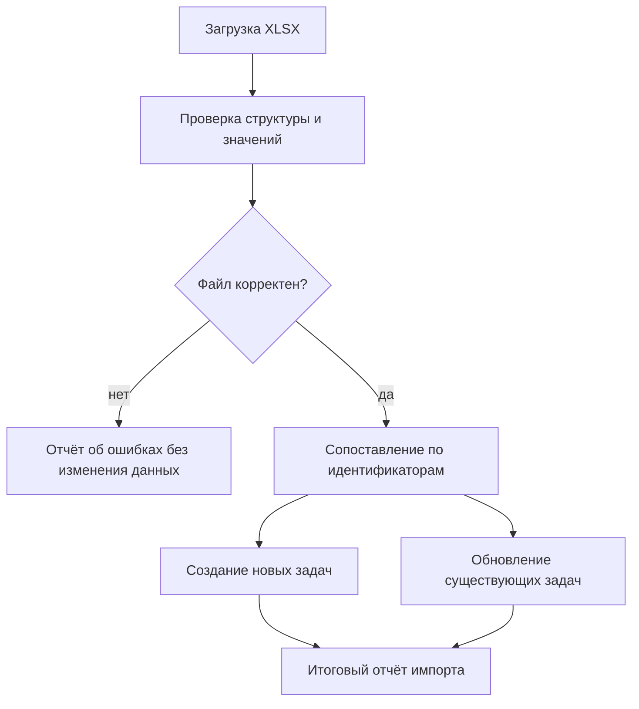

# Видение системы Task Tracker

## Назначение документа

Документ описывает целевое видение Task Tracker на основании [системных требований](system-requirements.md): какую проблему решает продукт, для кого он создаётся, что входит в первую версию и как выглядят ключевые рабочие процессы. Детальные правила, поля данных и критерии приёмки остаются в исходном документе требований.

## Видение продукта

Task Tracker — единое рабочее пространство команды для планирования и выполнения задач. Система объединяет бэклог, канбан-доску, итерации, декомпозицию работ, обсуждение и учёт времени, чтобы участники видели текущее состояние работы, а руководитель мог оценивать нагрузку и результат итерации на основе актуальных данных.

Главная ценность продукта — прозрачный путь задачи от регистрации до завершения без разрыва между планом, фактическим выполнением и последующим анализом. Обмен через Excel обеспечивает переносимость данных и работу с привычным для пользователей форматом.

## Пользователи и их цели

| Пользователь | Основная цель |
|---|---|
| Участник команды | Понимать свои задачи, менять их состояние, обсуждать работу и фиксировать затраченное время. |
| Руководитель / планировщик | Управлять бэклогом, приоритетами, назначениями и итерациями, контролировать сроки и трудоёмкость. |
| Администратор | Управлять пользователями, правами доступа и общими справочниками процесса. |

## Границы первой версии

В первую версию входят:

- задачи и ошибки с единым набором основных атрибутов;
- бэклог с фильтрацией и сортировкой;
- карточка задачи, один исполнитель, комментарии и дочерние задачи;
- настраиваемые статусы и канбан-доска;
- плановая, фактическая и оставшаяся трудоёмкость;
- формирование, контроль и завершение итераций;
- двусторонний обмен задачами через `.xlsx`;
- базовое ролевое разграничение доступа, проверяемое сервером.

До отдельного согласования за границами первой версии остаются уведомления, расширенная аналитика, WIP-лимиты, планирование ёмкости команды, внешние интеграции и полная история всех изменений.

## Функциональные требования

Система должна предоставлять следующие основные возможности:

- создание, просмотр, изменение, архивирование и отбор задач в едином бэклоге;
- ведение карточки задачи, назначение исполнителя, приоритета, сроков и статуса;
- визуальное управление задачами на канбан-доске;
- декомпозиция задач без циклических связей, ведение комментариев и трудозатрат;
- создание, наполнение, контроль и завершение итераций с расчётом итоговых показателей;
- управление статусами, видами задач, пользователями и правами в пределах роли;
- импорт и экспорт задач в формате `.xlsx` с проверкой и отчётом о результате.

## Нефункциональные требования

- Операции сохранения и импорта должны сохранять целостность данных и возвращать понятные ошибки.
- Автор и время создания и последнего изменения задачи должны фиксироваться.
- Авторизация операций должна контролироваться на сервере в соответствии с ролью пользователя.
- Даты и время должны иметь однозначный формат и согласованный часовой пояс.
- Экспорт должен открываться в актуальных версиях Microsoft Excel и совместимых редакторах.
- Параметры производительности, доступности, резервного копирования и восстановления должны быть определены до эксплуатации.

## Требования к интеграциям

В первой версии предусмотрена файловая интеграция с Microsoft Excel и совместимыми табличными редакторами через формат `.xlsx`. Экспорт должен включать идентификаторы, поля задач и необходимые справочные значения, а неизменённый файл — импортироваться обратно без потери поддерживаемых данных. Импорт должен проверять структуру, форматы и связи до применения, создавать или обновлять задачи по идентификатору и формировать отчёт об ошибках и выполненных изменениях.

Интеграции с системами авторизации, уведомлений и другими внешними сервисами не входят в подтверждённый объём первой версии. Их состав, протоколы, правила синхронизации, обработка конфликтов и требования безопасности необходимо согласовать отдельно.

## Ключевые процессы

### Жизненный цикл задачи

Задача или ошибка создаётся в общем бэклоге и получает уникальный идентификатор, вид, статус и приоритет. Перед началом работы руководитель уточняет оценку и сроки, назначает одного исполнителя и при необходимости включает задачу в итерацию. Исполнитель перемещает карточку между колонками канбан-доски; каждое перемещение сохраняет новый статус. Завершение не удаляет задачу: она остаётся доступной как часть истории работы.

### Планирование и контроль итерации

Руководитель создаёт итерацию с датами и отбирает задачи из бэклога. Одна задача может находиться не более чем в одной незавершённой итерации. После запуска система агрегирует количество задач по статусам, плановые и фактические часы, оставшееся время и долю завершённых задач. При завершении фиксируются состав и результаты итерации, а незавершённые задачи остаются в бэклоге для дальнейшего планирования.

### Учёт трудоёмкости

Плановая трудоёмкость задаётся в часах. Исполнитель добавляет отдельные записи о затратах времени с датой и автором, после чего система суммирует их в фактическую трудоёмкость и автоматически вычисляет остаток как разницу между планом и фактом. Отрицательный остаток отображается как перерасход, а не заменяется нулём. Эти показатели доступны в карточке задачи и агрегируются на уровне итерации.

### Декомпозиция и совместная работа

Крупная задача может быть разбита на дочерние, каждая из которых сохраняет собственные сроки, статус, исполнителя и оценку. Система показывает непосредственные связи и не допускает циклов в иерархии. Комментарии отображаются хронологически с автором и временем создания, формируя контекст выполнения задачи.

### Обмен данными через Excel

Экспорт формирует `.xlsx`, достаточный для последующего восстановления поддерживаемых данных. При обратном импорте существующие задачи сопоставляются по уникальному идентификатору, а новые создаются. До записи система проверяет структуру файла, обязательные поля, форматы и ссылки; пользователю показывается результат с числом созданных, обновлённых и отклонённых записей. Некорректные данные не должны приводить к незаметному частичному обновлению.

## Принципы продукта

- **Целостность:** критичные операции сохраняют согласованное состояние либо завершаются понятной ошибкой.
- **Прозрачность:** статусы, сроки и показатели времени видимы в контексте задачи и итерации.
- **Сохранность:** завершение работы и деактивация справочных значений не уничтожают связанные задачи.
- **Безопасность:** права контролируются на сервере, а не только элементами интерфейса.
- **Переносимость:** неизменённый экспортированный файл можно импортировать обратно без потери поддерживаемых данных.

## Критерий успеха первой версии

Первая версия успешна, если команда может провести полный рабочий цикл — зарегистрировать и декомпозировать задачи, спланировать итерацию, выполнить работу через канбан-доску, зафиксировать обсуждение и трудозатраты, завершить итерацию и перенести данные через Excel — без нарушения описанных бизнес-правил и потери информации.

## Открытые решения

Перед проектированием и вводом в эксплуатацию необходимо уточнить модель авторизации и точные права ролей, начальные статусы и допустимые переходы, правила агрегации дочерних задач, состав Excel-обмена, разрешение конфликтов импорта, ожидаемую нагрузку, а также требования к развёртыванию, резервному копированию и восстановлению.
