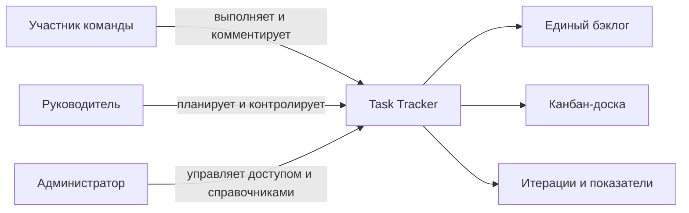
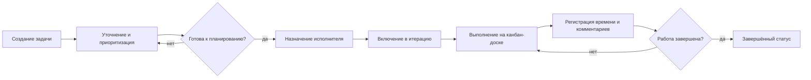
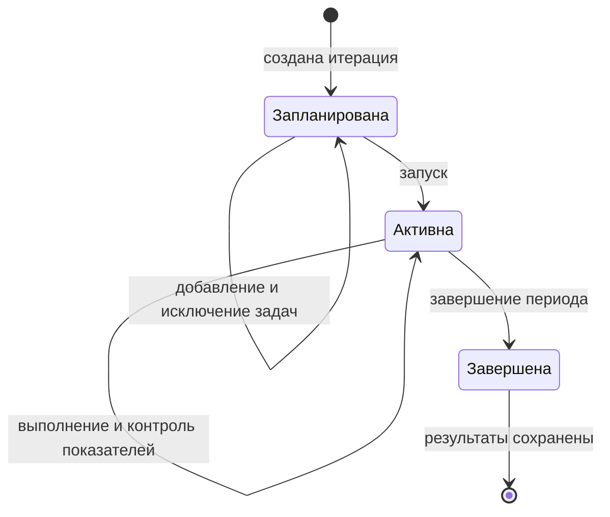

# Видение системы Task Tracker

## Назначение документа

Документ описывает целевое видение Task Tracker на основании [системных требований](system-requirements.md): какую проблему решает продукт, для кого он создаётся, какую функциональность предоставляет и как выглядят ключевые рабочие процессы. Детальные правила, поля данных и критерии приёмки остаются в исходном документе требований.

## Видение продукта

Task Tracker — единое рабочее пространство команды для планирования и выполнения задач. Система объединяет бэклог, канбан-доску, итерации, декомпозицию работ, обсуждение и учёт времени, чтобы участники видели текущее состояние работы, а руководитель мог оценивать нагрузку и результат итерации на основе актуальных данных.

Главная ценность продукта — прозрачный путь задачи от регистрации до завершения без разрыва между планом, фактическим выполнением и последующим анализом.

## Пользователи и их цели

| Пользователь | Основная цель |
|---|---|
| Участник команды | Понимать свои задачи, менять их состояние, обсуждать работу и фиксировать затраченное время. |
| Руководитель / планировщик | Управлять бэклогом, приоритетами, назначениями и итерациями, контролировать сроки и трудоёмкость. |
| Администратор | Управлять пользователями, правами доступа и общими справочниками процесса. |

## Функциональные требования

Система должна предоставлять следующие основные возможности:

- создание, просмотр, изменение, архивирование и отбор задач в едином бэклоге;
- ведение карточки задачи, назначение исполнителя, приоритета, сроков и статуса;
- ведение истории изменений карточки задачи с возможностью просмотра предыдущих и новых значений;
- прикрепление файлов к задаче, просмотр и скачивание вложений, а также их удаление при наличии соответствующих прав;
- визуальное управление задачами на канбан-доске;
- декомпозиция задач без циклических связей, ведение комментариев и трудозатрат;
- создание, наполнение, контроль и завершение итераций с расчётом итоговых показателей;
- управление статусами, видами задач, пользователями и правами в пределах роли;
- формирование и отображение встроенных уведомлений при изменении статуса задачи;
- создание задач вида «Ошибка» внешними сервисами через API.

## Нефункциональные требования

- Операции изменения данных должны сохранять их целостность и возвращать понятные ошибки.
- Для каждого изменения карточки должны фиксироваться автор или внешний источник, дата и время, изменённые поля, предыдущие и новые значения.
- Авторизация операций должна контролироваться на сервере в соответствии с ролью пользователя.
- Уведомление должно создаваться только после успешного сохранения нового статуса и не должно теряться при штатной работе системы.
- Даты и время должны иметь однозначный формат и согласованный часовой пояс.
- Параметры производительности, доступности, резервного копирования и восстановления должны быть определены до эксплуатации.

## Требования к интеграциям

Система должна предоставлять документированный и защищённый API, через который внешний сервис может создать задачу вида «Ошибка». Запрос должен проходить аутентификацию и общую проверку бизнес-правил, а ответ — содержать результат операции и уникальный идентификатор созданной задачи. Ошибочный запрос не должен приводить к частичному созданию данных и должен возвращать понятное описание причины отказа.

Состав интеграций с системами авторизации, email, мессенджерами, push-уведомлениями и другими внешними сервисами необходимо согласовать отдельно. Для каждой интеграции должны быть определены протоколы, правила синхронизации и доставки, обработка ошибок и требования безопасности.

## Ключевые процессы

### Жизненный цикл задачи

Задача или ошибка создаётся в общем бэклоге и получает уникальный идентификатор, вид, статус и приоритет. Перед началом работы руководитель уточняет оценку и сроки, назначает одного исполнителя и при необходимости включает задачу в итерацию. Исполнитель перемещает карточку между колонками канбан-доски; каждое перемещение сохраняет новый статус. Завершение не удаляет задачу: она остаётся доступной как часть истории работы.

### История изменений карточки

После успешного сохранения изменений система добавляет запись в историю карточки задачи. Запись показывает, кто или какой внешний сервис выполнил изменение, когда оно произошло и какие значения были изменены. История доступна пользователям, имеющим право на просмотр задачи, и не изменяется вместе с текущими значениями карточки.

### Создание ошибки внешним сервисом

Внешний сервис аутентифицируется и передаёт через API данные новой ошибки. Платформа проверяет обязательные поля и бизнес-правила, создаёт задачу вида «Ошибка», фиксирует внешний источник в истории и возвращает её уникальный идентификатор. При ошибке валидации или доступа задача не создаётся.

### Уведомления о смене статуса

После успешного изменения статуса система должна создать встроенное уведомление для назначенного исполнителя, если он задан. Уведомление должно содержать идентификатор и наименование задачи, прежний и новый статус, автора изменения, дату и время, а также ссылку на карточку задачи. Пользователь должен видеть список своих уведомлений и иметь возможность отметить их прочитанными. Неуспешное изменение статуса не должно создавать уведомление.

### Планирование и контроль итерации

Руководитель создаёт итерацию с датами и отбирает задачи из бэклога. Одна задача может находиться не более чем в одной незавершённой итерации. После запуска система агрегирует количество задач по статусам, плановые и фактические часы, оставшееся время и долю завершённых задач. При завершении фиксируются состав и результаты итерации, а незавершённые задачи остаются в бэклоге для дальнейшего планирования.

### Учёт трудоёмкости

Плановая трудоёмкость задаётся в часах. Исполнитель добавляет отдельные записи о затратах времени с датой и автором, после чего система суммирует их в фактическую трудоёмкость и автоматически вычисляет остаток как разницу между планом и фактом. Отрицательный остаток отображается как перерасход, а не заменяется нулём. Эти показатели доступны в карточке задачи и агрегируются на уровне итерации.

### Декомпозиция и совместная работа

Крупная задача может быть разбита на дочерние, каждая из которых сохраняет собственные сроки, статус, исполнителя и оценку. Система показывает непосредственные связи и не допускает циклов в иерархии. Комментарии отображаются хронологически с автором и временем создания, формируя контекст выполнения задачи.

## Принципы продукта

- **Целостность:** критичные операции сохраняют согласованное состояние либо завершаются понятной ошибкой.
- **Прозрачность:** статусы, сроки и показатели времени видимы в контексте задачи и итерации.
- **Сохранность:** завершение работы и деактивация справочных значений не уничтожают связанные задачи.
- **Безопасность:** права контролируются на сервере, а не только элементами интерфейса.

## Критерий успеха системы

Система успешна, если команда может провести полный рабочий цикл — зарегистрировать и декомпозировать задачи, спланировать итерацию, выполнить работу через канбан-доску, получить уведомления об изменениях, зафиксировать обсуждение и трудозатраты и завершить итерацию — без нарушения описанных бизнес-правил и потери информации.

## Открытые решения

Перед проектированием и вводом в эксплуатацию необходимо уточнить модель авторизации и точные права ролей, начальные статусы и допустимые переходы, правила агрегации дочерних задач, ожидаемую нагрузку, а также требования к развёртыванию, резервному копированию и восстановлению.
