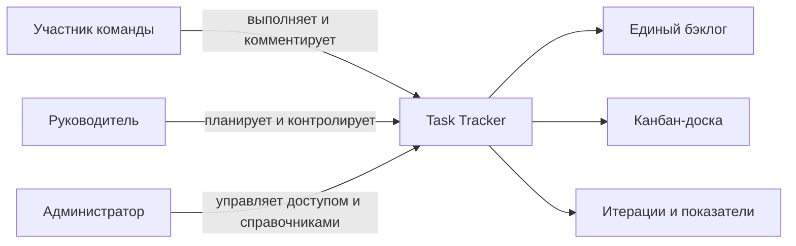
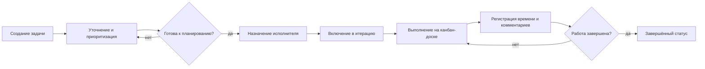
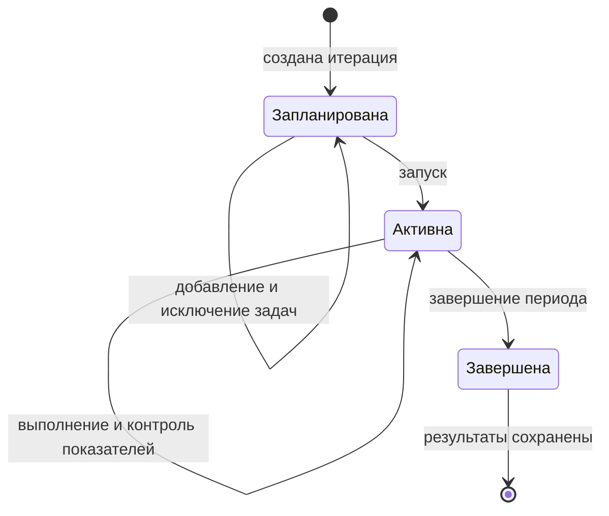

# Видение системы Task Tracker

## Назначение документа

Документ описывает целевое видение Task Tracker на основании [системных требований](system-requirements.md): какую проблему решает продукт, для кого он создаётся, какую функциональность предоставляет и как выглядят ключевые рабочие процессы. Детальные правила, поля данных и критерии приёмки остаются в исходном документе требований.

## Видение продукта

Task Tracker — единое рабочее пространство команды для планирования и выполнения задач. Система объединяет бэклог, канбан-доску, итерации, декомпозицию работ, обсуждение и учёт времени, чтобы участники видели текущее состояние работы, а руководитель мог оценивать нагрузку и результат итерации на основе актуальных данных.

Главная ценность продукта — прозрачный путь задачи от регистрации до завершения без разрыва между планом, фактическим выполнением и последующим анализом.

## Пользователи и их цели

| Пользователь | Основная цель |
|---|---|
| Участник команды | Понимать свои задачи, менять их состояние, обсуждать работу и фиксировать затраченное время. |
| Руководитель / планировщик | Управлять бэклогом, приоритетами, назначениями и итерациями, контролировать сроки и трудоёмкость. |
| Администратор | Управлять пользователями, правами доступа и общими справочниками процесса. |

## Функциональные требования

Система должна предоставлять следующие основные возможности:

- создание, просмотр, изменение, безвозвратное удаление и отбор рабочих элементов в едином бэклоге;
- ведение карточки задачи, назначение исполнителя, приоритета, сроков и статуса;
- поддержка типов «Проект», «Эпик», «Задача», «Ошибка» и «Подзадача»;
- ведение истории изменений карточки задачи с возможностью просмотра каждого изменения в формате diff;
- прикрепление файлов к задаче, просмотр и скачивание вложений, а также их удаление при наличии соответствующих прав;
- визуальное управление задачами на канбан-доске;
- декомпозиция задач без циклических связей, ведение комментариев и трудозатрат;
- создание, наполнение, контроль и завершение итераций с расчётом итоговых показателей;
- управление статусами, видами задач и правами пользователей в пределах роли;
- формирование и отображение встроенных уведомлений при любом изменении задачи, включая назначение и переназначение исполнителя;
- создание задач вида «Ошибка» сервисом тестирования через API;
- предоставление данных сервису отчётности через API;
- получение пользователей, команд и подразделений из внешнего сервиса справочников.

## Нефункциональные требования

- Операции изменения данных должны сохранять их целостность и возвращать понятные ошибки.
- Для каждого изменения карточки должны фиксироваться автор или внешний источник, дата и время, изменённые поля, предыдущие и новые значения.
- Авторизация операций должна контролироваться на сервере в соответствии с ролью пользователя.
- Уведомление должно создаваться только после успешного изменения задачи и не должно теряться при штатной работе системы.
- Жёсткое удаление должно выполняться атомарно и не оставлять нарушенных ссылок или зависимых данных.
- Интеграционные операции должны быть наблюдаемыми: система фиксирует результат, длительность и идентификатор запроса без записи секретов в журнал.
- Даты и время должны иметь однозначный формат и согласованный часовой пояс.
- Параметры производительности, доступности, резервного копирования и восстановления должны быть определены до эксплуатации.

## Требования к интеграциям

### Сервис тестирования

Task Tracker должен предоставлять защищённую операцию API для создания задачи типа «Ошибка» по результатам тестирования. Запрос передаёт как минимум внешний идентификатор дефекта, наименование, описание, серьёзность, сведения об окружении или сборке и ссылки на тестовый запуск либо тест-кейс. Серьёзность преобразуется в приоритет по согласованному правилу, а статус новой ошибки определяется настройками процесса.

Повторный запрос с теми же идентификаторами источника и дефекта не должен создавать дубликат. Успешный ответ содержит внутренний идентификатор и ссылку на созданную или ранее зарегистрированную ошибку. Ошибки доступа, валидации и сопоставления справочных значений возвращаются вызывающему сервису в структурированном виде. В истории карточки фиксируются внешний источник и исходный идентификатор дефекта.

### Сервис отчётности

Task Tracker должен предоставлять защищённое API только для чтения, через которое сервис отчётности получает данные о проектах, эпиках, задачах, итерациях, статусах и трудозатратах. API должно поддерживать фильтры по периоду, проекту, итерации, типу, статусу и исполнителю, а для больших выборок — пагинацию.

В ответах используются стабильные идентификаторы, однозначные даты и время, а также согласованные единицы измерения. Данные должны быть достаточны для расчёта числа задач по статусам, плановой, фактической и оставшейся трудоёмкости, доли завершённых задач, просрочек и перерасхода. Сервис отчётности не должен получать данные, не необходимые для построения отчётов.

### Сервис справочников

Task Tracker должен обращаться к API сервиса справочников и получать актуальные сведения о пользователях, командах и подразделениях: стабильный внешний идентификатор, отображаемое наименование и признак активности. Внешние справочные значения используются при назначении исполнителей, фильтрации и формировании отчётности; изменять их средствами Task Tracker нельзя.

Синхронизация выполняется периодически и может быть запущена администратором вручную. Последняя успешно полученная версия кэшируется, чтобы временная недоступность сервиса не блокировала чтение существующих задач. Неактивные или исчезнувшие значения сохраняются в уже созданных задачах, но не доступны для новых назначений. Ошибки синхронизации должны быть видимы администратору.

### Общие требования к API

- Все интеграции проходят аутентификацию и авторизацию от имени отдельного сервисного клиента и используют защищённый транспорт.
- Контракты API документируются в OpenAPI, версионируются и сохраняют обратную совместимость в пределах версии.
- Запросы и ответы используют единый формат ошибок и идентификатор корреляции для трассировки.
- Изменяющие операции выполняются атомарно; повторяемые запросы должны быть идемпотентными там, где возможна повторная доставка.
- Для исходящих запросов задаются тайм-ауты и ограниченные повторы; сбой внешнего сервиса не должен приводить к повреждению локальных данных.
- Точные правила аутентификации, лимиты запросов, объёмы выборок и сроки хранения интеграционных журналов должны быть согласованы до реализации.

## Ключевые процессы

### Типы рабочих элементов

| Тип | Назначение |
|---|---|
| Проект | Верхнеуровневая инициатива, объединяющая эпики и задачи общей целью. |
| Эпик | Крупный блок работ внутри проекта, который декомпозируется на задачи и ошибки. |
| Задача | Самостоятельная единица плановой работы с исполнителем, сроками и трудоёмкостью. |
| Ошибка | Дефект или некорректное поведение, требующее исправления. |
| Подзадача | Часть задачи или ошибки, выделенная для отдельного выполнения и контроля. |

Каждый рабочий элемент имеет ровно один тип. Базовая иерархия строится как `Проект → Эпик → Задача или Ошибка → Подзадача`; циклические связи запрещены. Тип отображается в карточке и используется для фильтрации бэклога.

### Жизненный цикл задачи

Задача или ошибка создаётся в общем бэклоге и получает уникальный идентификатор, вид, статус и приоритет. Перед началом работы руководитель уточняет оценку и сроки, назначает одного исполнителя и при необходимости включает задачу в итерацию. Исполнитель перемещает карточку между колонками канбан-доски; каждое перемещение сохраняет новый статус. Завершение не удаляет задачу: она остаётся доступной как часть истории работы.

### История изменений карточки

После успешного сохранения изменений система добавляет запись в историю карточки задачи. Запись показывает, кто или какой внешний сервис выполнил изменение, когда оно произошло и какие поля были изменены. Пользователь должен иметь возможность открыть изменение в формате diff: увидеть предыдущие и новые значения с визуальным выделением добавленных, удалённых и изменённых данных. История доступна пользователям, имеющим право на просмотр задачи, и не изменяется вместе с текущими значениями карточки.

### Создание ошибки внешним сервисом

Внешний сервис аутентифицируется и передаёт через API данные новой ошибки. Платформа проверяет обязательные поля и бизнес-правила, создаёт задачу вида «Ошибка», фиксирует внешний источник в истории и возвращает её уникальный идентификатор. При ошибке валидации или доступа задача не создаётся.

### Уведомления об изменениях и назначениях

После любого успешного изменения задачи система должна создать встроенное уведомление для текущего исполнителя, если он задан. К изменениям относятся обновление полей или статуса, добавление комментария, вложения или трудозатрат, изменение связей и удаление задачи. При назначении или переназначении отдельное уведомление получает новый исполнитель. Уведомление должно содержать идентификатор и наименование задачи, краткое описание изменения, автора, дату и время, а для существующей задачи — ссылку на её карточку. Пользователь должен видеть список своих уведомлений и иметь возможность отметить их прочитанными. Неуспешная операция не должна создавать уведомление.

### Планирование и контроль итерации

Руководитель создаёт итерацию с датами и отбирает задачи из бэклога. Одна задача может находиться не более чем в одной незавершённой итерации. После запуска система агрегирует количество задач по статусам, плановые и фактические часы, оставшееся время и долю завершённых задач. При завершении фиксируются состав и результаты итерации, а незавершённые задачи остаются в бэклоге для дальнейшего планирования.

### Учёт трудоёмкости

Плановая трудоёмкость задаётся в часах. Исполнитель добавляет отдельные записи о затратах времени с датой и автором, после чего система суммирует их в фактическую трудоёмкость и автоматически вычисляет остаток как разницу между планом и фактом. Отрицательный остаток отображается как перерасход, а не заменяется нулём. Эти показатели доступны в карточке задачи и агрегируются на уровне итерации.

### Декомпозиция и совместная работа

Крупная задача может быть разбита на дочерние, каждая из которых сохраняет собственные сроки, статус, исполнителя и оценку. Система показывает непосредственные связи и не допускает циклов в иерархии. Комментарии отображаются хронологически с автором и временем создания, формируя контекст выполнения задачи.

### Жёсткое удаление

Пользователь с соответствующим правом может безвозвратно удалить задачу после явного подтверждения. Задача и принадлежащие ей комментарии, вложения, трудозатраты и история изменений физически удаляются и не могут быть восстановлены через интерфейс или API. Если у задачи есть дочерние элементы, удаление блокируется до их удаления или переноса; остальные связи должны быть очищены без нарушения целостности данных.

## Принципы продукта

- **Целостность:** критичные операции сохраняют согласованное состояние либо завершаются понятной ошибкой.
- **Прозрачность:** статусы, сроки и показатели времени видимы в контексте задачи и итерации.
- **Сохранность:** завершение работы и деактивация справочных значений не уничтожают связанные задачи; исключение составляет только явное жёсткое удаление.
- **Безопасность:** права контролируются на сервере, а не только элементами интерфейса.

## Критерий успеха системы

Система успешна, если команда может провести полный рабочий цикл — зарегистрировать и декомпозировать задачи, спланировать итерацию, выполнить работу через канбан-доску, получить уведомления об изменениях, зафиксировать обсуждение и трудозатраты и завершить итерацию — без нарушения описанных бизнес-правил и потери информации.

## Открытые решения

Перед проектированием и вводом в эксплуатацию необходимо уточнить модель авторизации и точные права ролей, начальные статусы и допустимые переходы, правила агрегации дочерних задач, ожидаемую нагрузку, а также требования к развёртыванию, резервному копированию и восстановлению.
